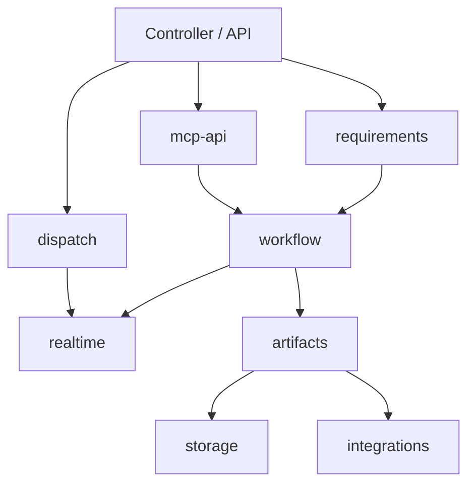

# 后端服务技术设计

## 1. 设计目标

后端服务是 AI 需求管理平台的业务核心，负责需求数据、状态机、派发入口、产物管理、实时事件推送和对外 API。前端、移动端、MCP / Skills、本地 Codex 执行器都必须通过后端服务完成业务操作。

后端的核心原则：

- 状态流转只由后端状态机裁决。
- 前端只发起操作，不自行判断复杂业务规则。
- MCP / Skills 可以请求状态变更，但不能绕过后端。
- 任务派发模块通过 WebSocket 接收云端下发的派发任务，根据 `requirement_id` 和 `stage` 组装 prompt，不直接推进需求状态。
- 第一版不持久化完整 AI 任务、派发任务、Agent 注册信息、站内通知、操作事件流和 review notes，优先保持后端模型轻量。

## 2. 推荐技术栈

### 2.1 推荐方案

第一版推荐采用 Cloudflare-native 架构：

- 运行时：Cloudflare Workers
- 后端框架：Hono
- 语言：TypeScript
- 数据库：Cloudflare D1
- ORM：Drizzle ORM 或 D1 原生 SQL
- API：REST 起步，OpenAPI 自动生成文档
- 鉴权：Bearer Token 起步，后续扩展用户登录和 RBAC
- 任务派发：本地派发模块主动连接 Cloudflare Durable Objects WebSocket，云端通过连接下发派发任务
- 实时事件：Server-Sent Events，运行在 Workers 上
- 文件存储：Cloudflare R2
- 前端部署：Cloudflare Pages 或 Workers Static Assets
- 后端部署：Cloudflare Workers

选择 Cloudflare-native 架构的原因：

- 最终云端部署目标是 Cloudflare，可以直接使用 Workers、D1、R2、Durable Objects。
- D1 足够承载 MVP 的需求和产物数据，不需要自建 PostgreSQL。
- R2 适合保存测试截图、报告附件等对象文件，前端可以通过 URL 访问。
- Durable Objects 适合维护本地派发模块的 WebSocket 长连接和短时 ACK。
- TypeScript 可以同时覆盖前端、后端、MCP Server 和本地派发模块。

### 2.2 Cloudflare 产品映射

Cloudflare 免费计划可以覆盖 MVP 的主要云端能力，具体额度以后续官方价格页为准。

| 平台能力 | Cloudflare 产品 | MVP 用法 |
| --- | --- | --- |
| 前端部署 | Cloudflare Pages / Workers Static Assets | 部署 Web 前端 |
| 后端 API | Cloudflare Workers | 提供 REST API、MCP / Skills API、SSE |
| 数据库 | Cloudflare D1 | 保存 `requirements` 和 `artifacts` |
| 对象存储 | Cloudflare R2 | 保存测试截图、报告附件等文件 |
| 派发长连接 | Durable Objects WebSocket | 维护本地派发模块连接、下发任务、等待 ACK |
| 实时事件 | Workers SSE | 推送需求状态变化给前端 |
| 后续队列 | Cloudflare Queues | MVP 暂不使用，后续可靠异步任务再引入 |

### 2.3 可选方案

NestJS + PostgreSQL 仍可作为自托管或传统云部署备选方案，但不作为第一版推荐。FastAPI + Python 也可行，不过本平台的 AI 执行逻辑主要放在 Codex 和 Skill，不在后端里直接做模型编排，所以后端优先选 TypeScript 更均衡。

## 3. 后端模块划分

```text
backend
  auth              鉴权与调用方身份
  requirements      需求管理
  workflow          状态机与流转规则
  dispatch          Durable Objects WebSocket 派发与短时 ACK
  artifacts         PR、报告、截图等产物
  realtime          SSE 实时事件推送
  storage           R2 上传与访问
  mcp-api           MCP / Skills 调用接口
  integrations      GitHub / GitLab 等外部集成
```

模块依赖建议：



## 4. 核心数据模型

### 4.1 requirements

需求主表，保存需求当前快照。

字段建议：

- `id`：UUID
- `serial_no`：可读编号，例如 `REQ-000123`
- `title`：需求标题
- `description`：需求描述，支持 Markdown
- `status`：当前状态
- `priority`：优先级，`low` / `medium` / `high` / `urgent`
- `created_by`：创建人
- `assignee_id`：当前人工负责人
- `version`：需求有效版本，创建时为 `1`，每次回退时递增
- `archived_at`：归档时间
- `created_at` / `updated_at`

### 4.2 artifacts

产物表，保存 PR、报告、截图、文档、日志等。第一版保留这个薄表，因为需求详情页和 review 页面需要消费这些链接。

字段建议：

- `id`
- `requirement_id`
- `type`：`tech_design_pr` / `case_pr` / `code_pr` / `test_report` / `screenshot` / `log` / `document`
- `title`
- `url`
- `storage_key`：如果是本地或对象存储文件
- `metadata`：JSONB，例如测试通过数、截图说明、PR provider
- `requirement_version`：产物创建时对应的需求版本
- `status_snapshot`：可选，产物提交时的需求状态；如果 `type` 已经能表达阶段，MVP 可以不加
- `created_by_type`
- `created_by_id`
- `created_at`

消费场景：

- 需求详情页展示当前阶段最重要的 PR、测试报告和截图。
- review 页面根据当前状态展示对应产物，例如 `tech-review` 展示技术方案 PR。
- Skill 再次执行时可以读取历史产物，作为修订上下文。
- 回退后旧产物不删除，前端根据 artifact 的 `requirement_version` 判断当前有效产物和历史参考产物。
- 测试截图等本地文件需要上传到对象存储，前端通过 artifact 的 `url` 访问。

### 4.3 第一版不建表的对象

第一版暂不建立以下表：

- `requirement_events`：如果只用于操作历史和 timeline，MVP 可以先不保留。前端通过当前需求状态、artifacts 和实时事件即可完成核心闭环。
- `dispatch_jobs`：MVP 中派发通过 Durable Object WebSocket 短时下发并等待 ACK，不持久化派发任务。派发成功或失败直接返回给前端 toast。
- `ai_tasks`：不记录完整 AI 执行生命周期。Codex 后续是否执行，以 Skill 是否更新需求状态为准。
- `review_notes`：review 评论优先沉淀在 GitHub PR comment 中。需要 AI 修改时，Skill prompt 提示 Codex 读取 PR comment。
- `agents`：默认只有一个本地连接的派发模块，不做注册、心跳和能力管理。WebSocket 连接在线状态保存在运行时连接管理中。
- `notifications`：不保存通知记录。后端通过 SSE 推送实时事件，前端收到后 toast 提示并刷新数据。

后续如果需要审计、可靠派发、断线恢复或团队协作，再引入：

- `requirement_events`：保存完整 timeline 和审计记录。
- `dispatch_jobs`：保存待下发、已下发、已 ACK、失败、超时的派发任务。

## 5. 状态机设计

### 5.1 状态定义

```text
planning       需求规划中，用户可编辑需求并派发技术方案设计
tech-design    AI 正在进行技术方案设计
tech-review    技术方案待用户 review
case-rundown   AI 正在进行测试用例设计
case-review    测试用例待用户 review
developing     AI 正在进行开发
delivery       开发完成，待用户验收
archived       需求已归档
```

### 5.2 操作定义

后端不建议暴露“直接改状态”接口，而是暴露业务操作。

核心操作：

- `create_requirement`
- `dispatch_skill_instruction`
- `start_ai_stage`
- `complete_ai_stage`
- `fail_ai_stage`
- `approve_review`
- `rollback_requirement`
- `archive_requirement`
- `reopen_requirement`，可作为后续能力

### 5.3 正向流转


### 5.4 回退规则

回退支持回到当前状态之前的流程状态，不限制只能回到前一个状态。

规则建议：

- 只有人工 review 类状态允许用户发起回退：`tech-review`、`case-review`、`delivery`。
- 回退目标必须是当前状态之前的合法流程状态，或 `planning`。
- 回退必须填写原因。
- 所有回退都会让 `requirements.version += 1`。
- 回退后旧产物不删除，但标记为历史产物。
- 回退到 `planning` 后允许用户修改需求描述。
- 从回退状态再次派发 AI 时，Skill 需要读取回退原因和历史产物，生成修订任务。

### 5.5 产物版本规则

`requirements.version` 用于区分当前有效产物和历史参考产物。

规则建议：

- 创建需求时，`requirements.version = 1`。
- 正向流转不改变 `requirements.version`。
- AI 提交 artifact 时，`artifacts.requirement_version = requirements.version`。
- 用户发起任意回退时，`requirements.version += 1`。
- 前端判断 `artifact.requirement_version === requirement.version` 时展示为当前有效产物。
- 前端判断 `artifact.requirement_version < requirement.version` 时展示为历史参考产物。

### 5.6 状态机校验维度

每次流转至少校验：

- 当前状态是否匹配。
- 操作人角色是否允许。
- 目标状态是否合法。
- 必需产物是否齐全。
- 回退时是否有 review 意见。
- 归档时是否处于 `delivery` 且验收通过。

必需产物建议：

| 流转 | 必需产物 |
| --- | --- |
| `tech-design -> tech-review` | 技术方案 PR |
| `case-rundown -> case-review` | 用例 PR 或用例文档 |
| `developing -> delivery` | 开发 PR、测试报告、必要截图 |
| `delivery -> archived` | 用户验收记录 |

## 6. API 设计

API 第一版建议使用 REST，并通过 OpenAPI 生成文档。

### 6.1 前端 / 移动端 API

需求：

```text
POST   /api/requirements
GET    /api/requirements
GET    /api/requirements/:id
PATCH  /api/requirements/:id
POST   /api/requirements/:id/archive
```

Review：

```text
POST   /api/requirements/:id/reviews/approve
POST   /api/requirements/:id/reviews/rollback
```

派发：

```text
POST   /api/requirements/:id/dispatch
```

产物：

```text
GET    /api/requirements/:id/artifacts
POST   /api/requirements/:id/artifacts
POST   /api/artifacts/upload
```

实时事件：

```text
GET    /api/events
```

### 6.2 MCP / Skills API

MCP / Skills API 面向 AI 工具，建议使用单独前缀和 skill token。

```text
GET    /api/mcp/requirements/:id
GET    /api/mcp/requirements/:id/task-context
POST   /api/mcp/requirements/:id/status/start
POST   /api/mcp/requirements/:id/artifacts
POST   /api/mcp/requirements/:id/artifacts/upload
POST   /api/mcp/requirements/:id/complete-stage
POST   /api/mcp/requirements/:id/fail-stage
POST   /api/mcp/requirements/:id/notes
```

关键语义：

- `status/start` 用于 Skill 请求进入当前 AI 工作阶段，例如从 `planning` 进入 `tech-design`。
- `complete-stage` 会触发状态机根据当前状态和产物校验进入 review 或 delivery。
- `fail-stage` 通过 SSE 通知前端，不自动回退需求状态。

### 6.3 派发模块 WebSocket 协议

```text
GET    /api/dispatch/ws
```

本地派发模块主动连接云端后端 WebSocket。用户点击派发后，后端通过 Durable Object 找到当前在线连接，下发任务并短时等待 ACK。

后端下发消息：

```json
{
  "type": "dispatch.requested",
  "requestId": "dispatch_req_123",
  "requirementId": "REQ-000123",
  "stage": "tech_design"
}
```

派发模块收到后负责根据 `stage` 组装 prompt，例如：

```text
/pd-design REQ-000123
```

派发模块 ACK：

```json
{
  "type": "dispatch.acked",
  "requestId": "dispatch_req_123",
  "success": true
}
```

失败 ACK：

```json
{
  "type": "dispatch.acked",
  "requestId": "dispatch_req_123",
  "success": false,
  "errorMessage": "Codex 未连接"
}
```

关键语义：

- 后端只下发 `requirementId` 和 `stage`。
- prompt、Skill、slash command 映射由派发模块负责。
- ACK 成功只代表派发模块已收到并调用 Codex，不代表需求状态变化。
- 如果 WebSocket 不在线或 ACK 超时，派发接口返回失败，前端收到派发失败提示。
- MVP 不持久化派发记录；如果需要断线恢复和可靠派发，再增加 `dispatch_jobs` 表。

### 6.4 示例请求

创建需求：

```json
{
  "title": "支持用户导出订单报表",
  "description": "用户需要在订单列表按筛选条件导出 Excel 报表。",
  "priority": "high"
}
```

派发 Skill 指令：

```json
{
  "stage": "tech_design"
}
```

回退需求：

```json
{
  "targetStatus": "planning",
  "comment": "技术方案 review 后发现需求范围需要调整，先回到 planning 修改需求描述。"
}
```

AI 提交完成：

```json
{
  "artifacts": [
    {
      "type": "tech_design_pr",
      "title": "技术方案 PR",
      "url": "https://github.com/org/repo/pull/123"
    }
  ],
  "summary": "已完成技术方案设计，覆盖数据导出流程、权限校验和异步任务方案。"
}
```

## 7. 权限与鉴权

第一版身份模型可以简化为三类调用方：

- `user`：平台使用者，可以创建需求、review、回退、归档、派发任务。
- `skill`：MCP / Skills 调用方，用于读取需求上下文、提交产物、推进 AI 阶段。
- `dispatcher`：本地派发模块，用于建立 WebSocket 连接、接收派发任务、回传 ACK。

权限规则：

- 用户 token 可访问前端 API。
- skill token 只能访问 MCP / Skills API。
- skill 不能调用人工 review、归档和派发接口。
- dispatcher token 只能访问 `/api/dispatch/ws` 并回传派发 ACK。
- 所有状态变更都记录 actor。
- token 只存 hash，不明文落库。

团队版后续扩展：

- RBAC：owner、product、reviewer、developer、admin。
- 项目级权限。
- 需求级关注人和审批人。
- 操作审计导出。

## 8. 实时事件设计

第一版不保存 `notifications` 表，但需要实时事件通道让前端感知状态变化。推荐使用 SSE。

触发实时事件的节点：

- 进入 `tech-review`：通知用户 review 技术方案。
- 进入 `case-review`：通知用户 review 测试用例。
- 进入 `delivery`：通知用户验收交付。
- Skill 上报失败：通知用户处理失败。
- 派发失败：通知用户检查本地派发模块或 Codex 连接。
- 派发 ACK 成功：提示用户 Codex 已收到派发指令。
- 需求被回退、归档或更新。

SSE 接口：

```text
GET /api/events
```

事件格式：

```json
{
  "type": "requirement.updated",
  "requirementId": "REQ-000123",
  "status": "tech-review",
  "message": "技术方案已完成，待 review"
}
```

前端消费方式：

- 需求详情页收到 `requirement.updated` 后重新拉取需求详情和 artifacts。
- 需求列表页收到事件后刷新对应行状态。
- 前端根据事件 message 展示 toast。
- 浏览器通知由前端在用户授权后触发。

后续可扩展：

- 移动端 Push。
- 飞书 / Slack / 邮件。
- 通知持久化表。
- Webhook。

## 9. 一致性与并发控制

需要重点防止：

- 用户重复点击派发导致 Codex 重复收到指令。
- WebSocket 断线导致派发任务无法下发或 ACK 丢失。
- Skill 重复提交完成结果。
- 用户 review 或回退时，Skill 同时提交状态更新。
- 回退后旧 Skill 流程继续回写污染状态。

建议策略：

- 对 `requirements` 使用乐观锁字段 `version`。
- 状态流转在数据库事务内完成。
- 派发接口通过 Durable Object 下发任务，并等待短时 ACK。
- ACK 成功时接口返回派发成功；ACK 失败、超时或派发模块离线时接口返回派发失败。
- 派发接口可在前端按钮层做短时间禁用，降低重复派发概率。
- Skill 的 `complete-stage` 必须校验当前需求状态仍处于对应 AI 阶段。
- 回退后旧 Skill 再提交完成时，如果当前状态不匹配，应返回 `INVALID_STATUS_TRANSITION`。
- 所有状态变更都在事务内更新需求快照；状态变更成功后推送 SSE。

## 10. 错误处理

统一错误码建议：

- `INVALID_STATUS_TRANSITION`：非法状态流转。
- `MISSING_REQUIRED_ARTIFACT`：缺少必需产物。
- `DISPATCH_FAILED`：派发失败。
- `DISPATCHER_OFFLINE`：本地派发模块未连接。
- `CODEX_NOT_CONNECTED`：本地 Codex 不可用。
- `PERMISSION_DENIED`：权限不足。
- `VALIDATION_ERROR`：请求参数错误。

错误响应格式：

```json
{
  "error": {
    "code": "INVALID_STATUS_TRANSITION",
    "message": "当前状态不允许进入 delivery",
    "details": {}
  }
}
```

## 11. 测试策略

单元测试：

- 状态机合法流转。
- 状态机非法流转。
- 必需产物校验。
- 回退到前 N 个状态。
- skill 权限校验。
- dispatcher WebSocket 鉴权。

集成测试：

- 创建需求到派发技术设计。
- 后端通过 WebSocket 下发 `requirementId` 和 `stage`。
- 派发模块 ACK 后派发接口返回成功。
- Skill 请求进入 AI 工作状态。
- AI 提交产物进入 review。
- 用户 review 通过后派发下一阶段。
- 用户从 `delivery` 回退到 `planning`。
- 旧 Skill 流程在回退后提交完成应被拒绝。
- Skill 更新状态后 SSE 推送 `requirement.updated`。

端到端测试：

- 完整流程：`planning -> tech-design -> tech-review -> case-rundown -> case-review -> developing -> delivery -> archived`。
- 失败流程：派发模块离线、Codex 未连接、AI 执行失败、缺少测试报告。

## 12. 第一版落地范围

第一版建议实现：

- 需求 CRUD。
- 状态机核心流转。
- 回退到历史状态和 `planning`。
- WebSocket 下发派发任务。
- MCP / Skills 回写 API。
- 产物管理。
- 对象存储上传测试截图。
- SSE 实时事件。
- 单用户 + skill token + dispatcher token 鉴权。
- OpenAPI 文档。

第一版暂不实现：

- 多租户。
- 复杂 RBAC。
- 移动端 Push。
- Redis 队列。
- Temporal 工作流。
- `requirement_events` 表。
- `dispatch_jobs` 表。
- `ai_tasks` 表。
- `agents` 表。
- `notifications` 表。
- `review_notes` 表。
- PR 内容自动解析。
- 多代码平台深度集成。
