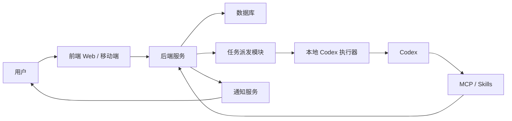
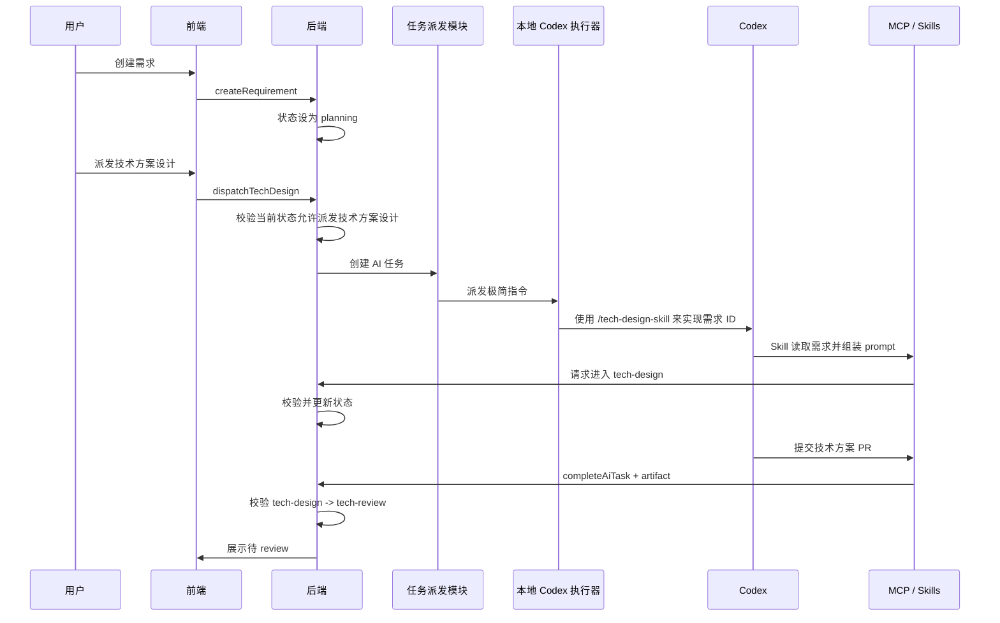
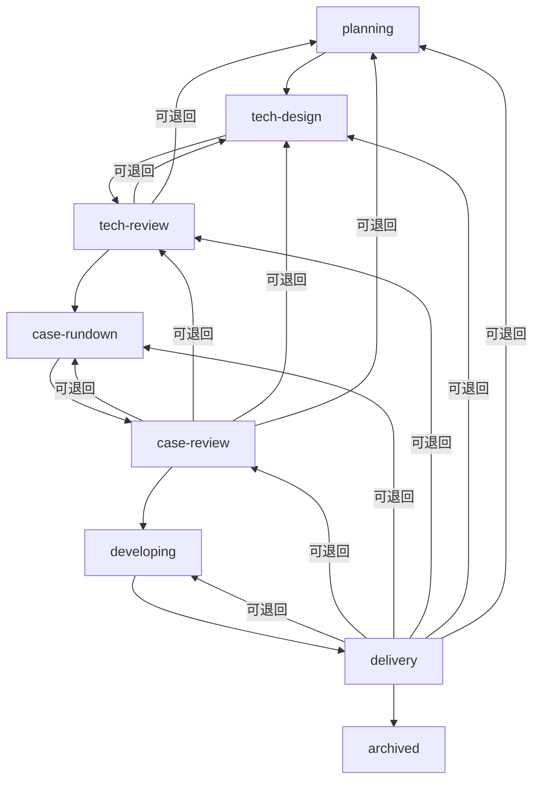
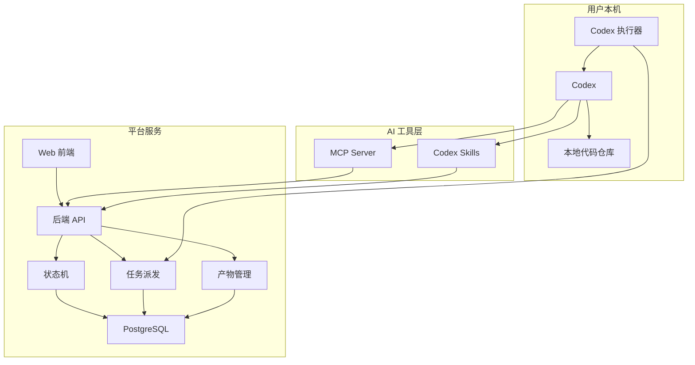

# AI 需求管理平台产品设计

## 1. 产品定位

这个平台面向 AI 辅助开发场景，用来管理一个应用从需求提出、技术方案设计、用例设计、开发交付到归档的完整流程。

平台本身不替代 Codex 写代码，而是负责管理需求状态、人工 review、AI 任务派发、AI 产物回收、通知和归档。Codex 负责执行具体的技术方案设计、测试用例设计和代码开发。

## 2. 总体模块

第一版平台由四个大模块组成：

1. 前端
2. 后端
3. MCP / Skills
4. 任务派发模块

其中后端是系统核心，负责状态机、数据存储、权限校验和业务规则。前端负责给用户提供需求管理和 review 工作台。MCP / Skills 负责给 AI 提供可调用的平台工具，并承担 AI 执行时的需求上下文组装和状态操作。任务派发模块只负责把一条极简指令转派给本地 Codex 执行，不负责拼接复杂 prompt。



## 3. 模块边界与职责

### 3.1 前端

前端是用户操作平台的主要入口，负责呈现需求、状态、AI 产物和 review 操作。

前端职责：

- 创建需求，支持输入简短或复杂的需求描述。
- 展示需求列表，支持按状态、优先级、更新时间筛选。
- 展示需求详情，包括当前状态、需求描述、AI 产物、PR 链接、测试报告、截图、历史流转记录。
- 在人工节点提供操作入口，例如派发给 AI、review 通过、退回修改、验收通过、归档。
- 展示通知，例如技术方案待 review、用例待 review、开发交付待验收。
- 后续移动端复用同一套后端 API，优先支持查看、review、通知和审批。

前端不负责：

- 不判断复杂状态流转是否合法。
- 不直接操作 Codex。
- 不直接写入本地仓库。
- 不绕过后端更新需求状态。

推荐技术栈：

- Web：Next.js + React + TypeScript。
- UI：Tailwind CSS 或 shadcn/ui。
- 移动端：React Native 或 Flutter。
- API 调用：REST 或 tRPC，取决于后端技术选型。

### 3.2 后端

后端是平台的业务核心，负责需求生命周期管理和状态机流转。

后端职责：

- 管理需求的创建、查询、编辑、归档。
- 管理状态机，统一校验所有状态流转。
- 管理人工 review，包括通过、退回、验收、归档。
- 管理 AI 任务，包括创建任务、锁定任务、任务完成、任务失败、重试。
- 管理 AI 产物，包括 PR 链接、技术方案、用例文档、测试报告、截图、执行日志。
- 提供前端 API。
- 提供 MCP / Skills 可调用的后端接口。
- 记录所有状态流转和关键操作的 timeline。
- 触发通知。

后端不负责：

- 不直接执行 Codex。
- 不直接修改业务代码仓库。
- 不直接决定 AI 如何实现需求。
- 不把状态流转规则分散到前端或执行器里。

推荐技术栈：

- 后端框架：NestJS + TypeScript，或 FastAPI + Python。
- 数据库：PostgreSQL。
- ORM：Prisma 或 SQLAlchemy。
- 队列：BullMQ / Redis，或后续使用 Temporal。
- 鉴权：本地优先可先使用个人 token；团队化后支持用户账号和 RBAC。
- 部署：Docker Compose 起步，后续支持云部署。

后端内部建议拆分：

```text
backend
  requirements       需求管理
  workflow           状态机
  reviews            人工 review
  ai-tasks           AI 任务
  artifacts          产物管理
  agents             本地执行器管理
  notifications      通知
  mcp-api            MCP / Skills 后端接口
```

### 3.3 MCP / Skills

MCP / Skills 是给 AI 使用的平台工具层。它让 Codex 可以读取需求、组装执行上下文、提交产物、更新任务结果，并通过后端 API 触发状态流转。复杂 prompt 拼接、阶段任务说明、产物提交格式等 AI 侧执行细节，都应放在 Skill 中维护，而不是放在任务派发模块中。

MCP / Skills 职责：

- 让 AI 获取需求详情和当前任务上下文。
- 根据需求 ID、当前状态和目标阶段组装 Codex 执行所需 prompt。
- 将“使用某个 Skill 实现需求 ID”的极简派发指令扩展为完整任务说明。
- 让 AI 提交技术方案 PR、用例设计 PR、开发 PR、测试报告和截图。
- 让 AI 标记任务完成或失败。
- 让 AI 追加说明、执行摘要和处理记录。
- 对 AI 暴露稳定、结构化、低歧义的工具接口。

MCP / Skills 不负责：

- 不绕过后端自行修改状态；所有状态变更仍需调用后端状态机接口。
- 不直接修改数据库。
- 不承担任务调度和重试。

推荐技术栈：

- MCP Server：TypeScript SDK 或 Python SDK。
- Skills：以 Codex Skill 形式包装常用工作流，例如“读取需求并完成技术方案设计”、“读取需求并完成用例设计”、“读取需求并完成开发交付”。
- 与后端通信：HTTP API + agent token。

建议暴露的工具：

```text
get_requirement
get_task_context
build_task_prompt
attach_artifact
complete_ai_task
fail_ai_task
append_requirement_note
```

### 3.4 任务派发模块

任务派发模块只负责把平台中的 AI 任务转派给本地 Codex 执行。它是后端和本地 Codex 执行器之间的薄桥，不负责复杂 prompt 组装、上下文整理、产物格式设计和状态变更。

任务派发模块职责：

- 接收后端创建的 AI 任务。
- 将任务转成极简 Codex 指令，例如：`使用 /xxx-skill 来实现需求 {{需求 Id}}`。
- 把极简指令派发给本地 Codex 执行。
- 向后端返回派发成功或派发失败结果。
- 记录派发时间、目标执行器、派发结果。
- 派发成功只更新 AI 任务的派发结果，不直接更新需求状态。

任务派发模块不负责：

- 不直接调用模型生成内容。
- 不拼接完整 prompt。
- 不读取和整理需求上下文。
- 不推进需求状态。
- 不直接创建 PR。
- 不直接运行测试。
- 不替代后端状态机做最终状态判断。

推荐技术栈：

- 第一版可以作为后端内部模块实现，也可以是一个很薄的本地转发服务。
- 本地 Codex 执行器单独实现为 daemon / worker。
- 后端任务队列：PostgreSQL task table 起步。
- 执行器通信：HTTP polling 起步，后续可升级 WebSocket 或 gRPC。

本地 Codex 执行器建议职责：

- 注册到平台并保持心跳。
- 领取已派发的 AI 任务。
- 启动 Codex 执行极简 Skill 指令，例如：`使用 /tech-design-skill 来实现需求 REQ-123`。
- 管理本地仓库路径、分支、PR、测试命令。
- 收集执行产物并通过 MCP / API 回写平台。

## 4. 模块协作流程

### 4.1 创建需求到技术方案 review



### 4.2 Review 通过后进入下一阶段



状态回退允许回退到前 N 个历史状态，而不是只能退回前一个状态。例如在准备进入开发时，如果用户发现需求大方向不符合预期，可以直接退回 `planning` 修改需求。后端状态机需要基于当前状态、历史状态、角色权限和退回原因判断目标状态是否合法。

## 5. 四个模块之间的规则边界

| 事情 | 前端 | 后端 | MCP / Skills | 任务派发模块 |
| --- | --- | --- | --- | --- |
| 创建需求 | 发起 | 负责 | 不参与 | 不参与 |
| 判断状态能否流转 | 不负责 | 负责 | 调用后端判断 | 不负责 |
| 派发 AI 任务 | 发起 | 负责入口和任务记录 | 不参与 | 只负责转派 |
| Codex 执行任务 | 不负责 | 不负责 | 组装执行上下文 | 本地执行器负责启动 |
| 提交 PR / 报告 / 截图 | 展示 | 存储记录 | 发起提交 | 不负责 |
| 人工 review | 发起 | 负责记录和流转 | 不参与 | 不参与 |
| 通知用户 | 展示 | 负责触发 | 不参与 | 不参与 |
| 归档需求 | 发起 | 负责 | 不参与 | 不参与 |

## 6. 推荐第一版实现边界

第一版建议控制范围：

- 先实现 Web，不先做移动端。
- 后端使用 PostgreSQL 保存需求、状态、任务和产物。
- 任务派发模块先保持极薄，只负责把 `使用 /xxx-skill 来实现需求 {{需求 Id}}` 这类指令转派给 Codex。
- 本地 Codex 执行器作为独立进程运行在用户机器上。
- MCP / Skills 先提供最小工具集，覆盖读取需求、组装 prompt、提交产物、状态更新、失败回写。
- 通知先做站内通知和浏览器通知，移动端推送后续再接。

第一版系统边界：


