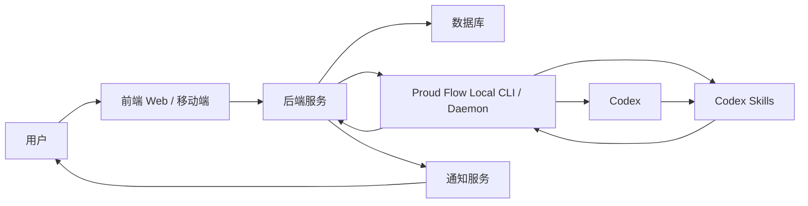
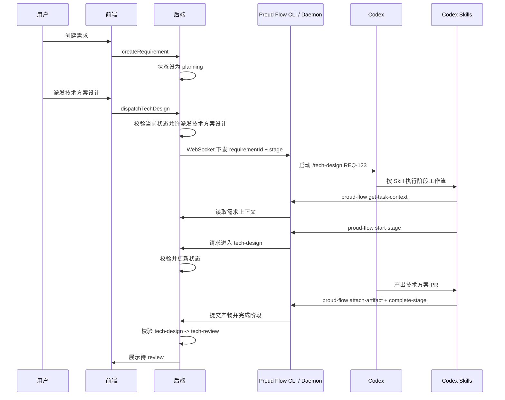
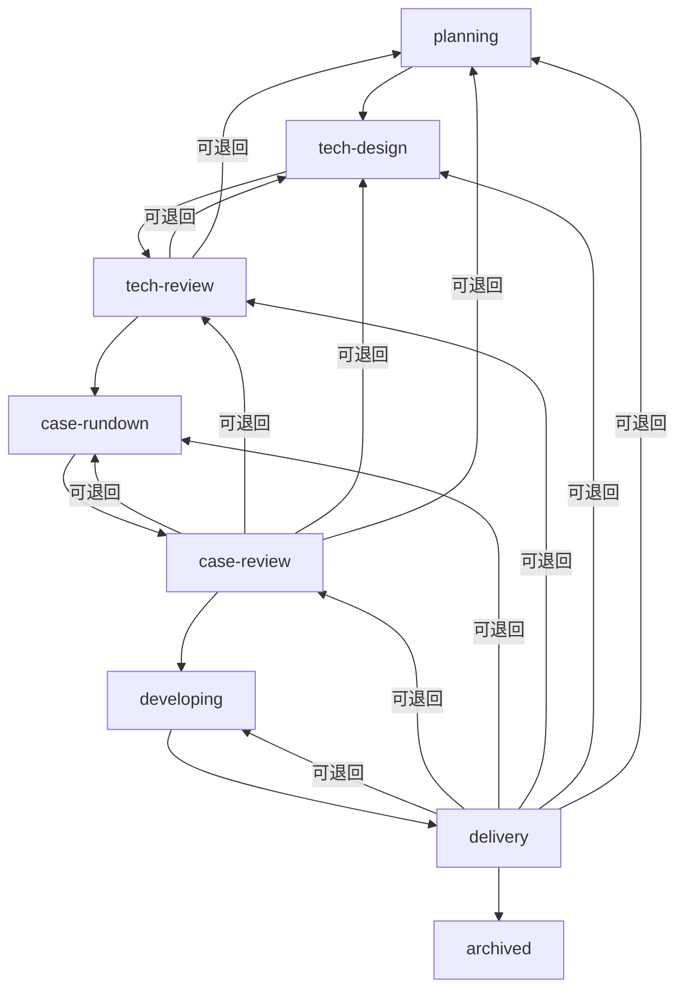
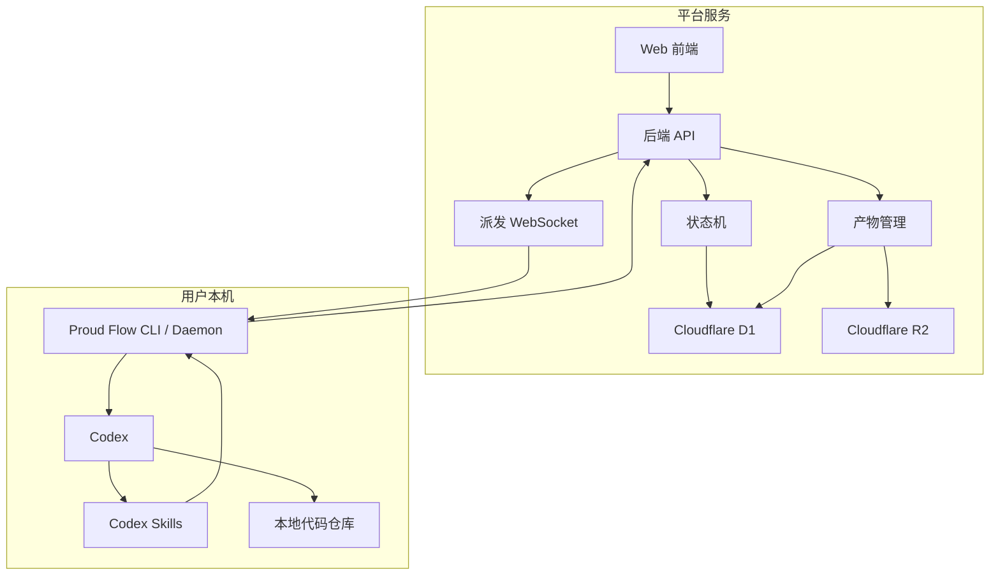

# AI 需求管理平台产品设计

## 1. 产品定位

这个平台面向 AI 辅助开发场景，用来管理一个应用从需求提出、技术方案设计、用例设计、开发交付到归档的完整流程。

平台本身不替代 Codex 写代码，而是负责管理需求状态、人工 review、AI 任务派发、AI 产物回收、通知和归档。Codex 负责执行具体的技术方案设计、测试用例设计和代码开发。

## 2. 总体模块

第一版平台由三个大模块组成：

1. 前端
2. 后端
3. Proud Flow Local CLI / Daemon

其中后端是系统核心，负责状态机、数据存储、权限校验和业务规则。前端负责给用户提供需求管理和 review 工作台。Proud Flow Local CLI / Daemon 是用户本机的统一入口，负责连接后端接收派发、启动 Codex、安装更新 Skills、管理本地 token，并作为 Skills 调用平台 API 的 helper。Skills 负责复杂 prompt、阶段说明和产物要求，但不单独作为平台服务部署，也不要求用户额外配置工具服务器。



## 3. 模块边界与职责

### 3.1 前端

前端是用户操作平台的主要入口，负责呈现需求、状态、AI 产物和 review 操作。

前端职责：

- 创建需求，支持输入简短或复杂的需求描述。
- 展示需求列表，支持按状态、优先级、更新时间筛选。
- 展示需求详情，包括当前状态、需求描述、AI 产物、PR 链接、测试报告、截图、历史流转记录。
- 在人工节点提供操作入口，例如派发给 AI、review 通过、退回修改、验收通过、归档。
- 展示通知，例如技术方案待 review、用例待 review、开发交付待验收。
- 后续移动端复用同一套后端 API，优先支持查看、review、通知和审批。

前端不负责：

- 不判断复杂状态流转是否合法。
- 不直接操作 Codex。
- 不直接写入本地仓库。
- 不绕过后端更新需求状态。

推荐技术栈：

- Web：Next.js + React + TypeScript。
- UI：Tailwind CSS 或 shadcn/ui。
- 移动端：React Native 或 Flutter。
- API 调用：REST 或 tRPC，取决于后端技术选型。

### 3.2 后端

后端是平台的业务核心，负责需求生命周期管理和状态机流转。

后端职责：

- 管理需求的创建、查询、编辑、归档。
- 管理状态机，统一校验所有状态流转。
- 管理人工 review，包括通过、退回、验收、归档。
- 管理 AI 任务，包括创建任务、锁定任务、任务完成、任务失败、重试。
- 管理 AI 产物，包括 PR 链接、技术方案、用例文档、测试报告、截图、执行日志。
- 提供前端 API。
- 提供 Skills API，供本地 `proud-flow` CLI helper 调用。
- 记录所有状态流转和关键操作的 timeline。
- 触发通知。

后端不负责：

- 不直接执行 Codex。
- 不直接修改业务代码仓库。
- 不直接决定 AI 如何实现需求。
- 不把状态流转规则分散到前端或执行器里。

推荐技术栈：

- 运行时：Cloudflare Workers。
- 后端框架：Hono + TypeScript。
- 数据库：Cloudflare D1。
- 对象存储：Cloudflare R2。
- 实时连接：Durable Objects WebSocket。
- 鉴权：本地优先可先使用个人 token；团队化后支持用户账号和 RBAC。
- 部署：Docker Compose 起步，后续支持云部署。

后端内部建议拆分：

```text
backend
  requirements       需求管理
  workflow           状态机
  reviews            人工 review
  ai-tasks           AI 任务
  artifacts          产物管理
  local-api          本地 CLI 初始化与 token 管理（Skill 由 CLI 内置安装）
  notifications      通知
  skills-api         Skills 回写与上下文接口
```

### 3.3 Proud Flow Local CLI / Daemon

Proud Flow Local CLI / Daemon 是用户本机上的统一入口。它让平台可以把 AI 任务派发给本地 Codex，也让 Skills 可以稳定调用后端 API 读取需求、提交产物和推进 AI 阶段。

Proud Flow Local CLI / Daemon 职责：

- `proud-flow daemon` 连接后端 WebSocket，接收派发请求并启动 Codex。
- 将后端下发的 `requirementId + stage` 映射为极简 Skill 指令，例如 `/tech-design REQ-123`。
- `proud-flow init` 完成本地初始化、token 领取和环境检查。
- 安装、更新和检查平台内置 Skills。
- 作为 CLI helper 给 Skills 提供稳定命令，例如 `get-task-context`、`attach-artifact`、`complete-stage`。
- 使用本地 skill token 调用后端 Skills API。
- 管理本地仓库路径、Codex 启动方式和本地日志。

Proud Flow Local CLI / Daemon 不负责：

- 不绕过后端自行修改状态；所有状态变更仍需调用后端状态机接口。
- 不直接修改数据库。
- 不判断人工 review 是否通过。
- 不直接拼接复杂 prompt；复杂 prompt 和阶段要求放在 Skills 中。
- 不直接执行远端动态命令。

推荐技术栈：

- 本地 CLI / Daemon：TypeScript + Node.js。
- 后端通信：WebSocket 派发 + REST Skills API。
- Codex Skills：以 Codex Skill 形式包装常用工作流，例如“读取需求并完成技术方案设计”、“读取需求并完成用例设计”、“读取需求并完成开发交付”。
- token 存储：macOS Keychain 优先，配置文件只保存非敏感配置。

建议 CLI helper 命令：

```text
get-requirement
get-task-context
start-stage
attach-artifact
upload-artifact
complete-stage
fail-stage
append-note
skill install/update/status
```

## 4. 模块协作流程

### 4.1 创建需求到技术方案 review



### 4.2 Review 通过后进入下一阶段



状态回退允许回退到前 N 个历史状态，而不是只能退回前一个状态。例如在准备进入开发时，如果用户发现需求大方向不符合预期，可以直接退回 `planning` 修改需求。后端状态机需要基于当前状态、历史状态、角色权限和退回原因判断目标状态是否合法。

## 5. 三个模块之间的规则边界

| 事情 | 前端 | 后端 | Proud Flow Local CLI / Daemon |
| --- | --- | --- | --- |
| 创建需求 | 发起 | 负责 | 不参与 |
| 判断状态能否流转 | 不负责 | 负责 | 调用后端判断 |
| 派发 AI 任务 | 发起 | 负责入口和下发 | daemon 只负责接收并启动 Codex |
| Codex 执行任务 | 不负责 | 不负责 | daemon 启动 Codex，Skills 组装执行上下文 |
| 提交 PR / 报告 / 截图 | 展示 | 存储记录 | Skills 通过 CLI helper 发起提交 |
| 人工 review | 发起 | 负责记录和流转 | 不参与 |
| 通知用户 | 展示 | 负责触发 | 不参与 |
| 归档需求 | 发起 | 负责 | 不参与 |

## 6. 推荐第一版实现边界

第一版建议控制范围：

- 先实现 Web，不先做移动端。
- 后端使用 Cloudflare D1 保存需求和产物，R2 保存截图和报告附件。
- Proud Flow Local CLI / Daemon 作为独立进程运行在用户机器上。
- daemon 先保持极薄，只负责把 `requirementId + stage` 映射为 `/xxx-skill REQ-123` 这类指令并启动 Codex。
- Skills 先提供最小工作流，覆盖读取需求、组装 prompt、提交产物、状态更新、失败回写。
- 通知先做站内通知和浏览器通知，移动端推送后续再接。

第一版系统边界：


